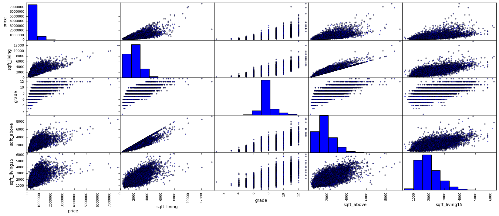
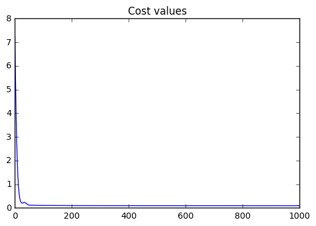

# Exploring King County, USA Housing Data

In this notebook we will be exploring the King County, USA Housing data set and seeing how well we can get a simple multiple linear regression model to predict the housing prices. The data set can be found [here](https://www.kaggle.com/harlfoxem/housesalesprediction). To tackle this problem we will be using the tensorflow, pandas, and numpy libraries. We are also using sys for outputing results.


```python
import tensorflow as tf
import pandas as pd
import numpy as np
import sys
```

Next we set our seeds and read in the data.


```python
np.random.seed(7)
tf.set_random_seed(7)
init_data = pd.read_csv("./kc_house_data.csv")
print("Col: {0}".format(list(init_data)))
```

    Col: ['id', 'date', 'price', 'bedrooms', 'bathrooms', 'sqft_living', 'sqft_lot', 'floors', 'waterfront', 'view', 'condition', 'grade', 'sqft_above', 'sqft_basement', 'yr_built', 'yr_renovated', 'zipcode', 'lat', 'long', 'sqft_living15', 'sqft_lot15']


Lets look at the data info to see what data types each of these columns are and see if there is any data missing.


```python
print(init_data.info())
```

    <class 'pandas.core.frame.DataFrame'>
    RangeIndex: 21613 entries, 0 to 21612
    Data columns (total 21 columns):
    id               21613 non-null int64
    date             21613 non-null object
    price            21613 non-null float64
    bedrooms         21613 non-null int64
    bathrooms        21613 non-null float64
    sqft_living      21613 non-null int64
    sqft_lot         21613 non-null int64
    floors           21613 non-null float64
    waterfront       21613 non-null int64
    view             21613 non-null int64
    condition        21613 non-null int64
    grade            21613 non-null int64
    sqft_above       21613 non-null int64
    sqft_basement    21613 non-null int64
    yr_built         21613 non-null int64
    yr_renovated     21613 non-null int64
    zipcode          21613 non-null int64
    lat              21613 non-null float64
    long             21613 non-null float64
    sqft_living15    21613 non-null int64
    sqft_lot15       21613 non-null int64
    dtypes: float64(5), int64(15), object(1)
    memory usage: 3.5+ MB
    None


We can see that all of the data types are numeric except for "date". We can also tell that each column has 21613 rows and none of the columns have missing data. So now we need to get rid of "id", because this is useless, and "date", because we just want to deal with numeric values.


```python
init_data = init_data.drop("id", axis=1)
init_data = init_data.drop("date", axis=1)
```

Now lets take a look at the how the rest of the data correlates with the "price" column.


```python
matrix_corr = init_data.corr()
print(matrix_corr["price"].sort_values(ascending=False))
```

    price            1.000000
    sqft_living      0.702035
    grade            0.667434
    sqft_above       0.605567
    sqft_living15    0.585379
    bathrooms        0.525138
    view             0.397293
    sqft_basement    0.323816
    bedrooms         0.308350
    lat              0.307003
    waterfront       0.266369
    floors           0.256794
    yr_renovated     0.126434
    sqft_lot         0.089661
    sqft_lot15       0.082447
    yr_built         0.054012
    condition        0.036362
    long             0.021626
    zipcode         -0.053203
    Name: price, dtype: float64


As we can see we have quite a few strong correlated features, with "zipcode" being the only negative correlating feature. We might want to experiment with seeing which features are the best to remove but for right now we will just remove "zipcode" and test the rest of the features.


```python
init_data = init_data.drop("zipcode", axis=1)
```

Lets graphically compare "price" to the top four correlated features to see if we can spot any trends or anomalies with the data.


```python
from pandas.tools.plotting import scatter_matrix
%matplotlib inline
## attributes to look at
attr = ["price", "sqft_living", "grade", "sqft_above", "sqft_living15"]
scatter_matrix(init_data[attr], figsize=(20,8) );
```





As we can see, it seems there are some possible outliers to worry about. So what we will do is standardize the data when we create our model so that we won't have to worry about this possible problem as much.

Now lets define a split function to permutate our data and split it into a training and test set that we can work with. We will have 80% as training data and 20% as test data.


```python
def split_data(data, ratio):
    shuffled_indices = np.random.permutation(len(data))
    test_set_size = int(len(data) * ratio)
    test_indices = shuffled_indices[:test_set_size]
    train_indices = shuffled_indices[test_set_size:]
    return data.iloc[train_indices], data.iloc[test_indices]

train_set, test_set = split_data(init_data, 0.2)
```

We need to split our training set into the data and its labels for our model. 


```python
data = (train_set.drop("price", axis=1)).values
data_labels = (train_set["price"].copy()).values
data_labels = data_labels.reshape([len(data_labels),1]) # forcing a [None, 1] shape
```

Next lets pull out some info we need to help set up our model, like the number of features we are using and the number of samples that we have.


```python
num_features = data.shape[1]
n_samples = data.shape[0]
```

Now its time to implement our model. We will define our inputs along with the weights and biases.


```python
X_init = tf.placeholder(tf.float32, [None, num_features])
Y_init = tf.placeholder(tf.float32, [None, 1])
W = tf.Variable(tf.random_normal([num_features,1]))
b = tf.Variable(tf.random_normal([1]))
```

Next what we are going to do is standardize our input data so that any possible outliers in the data won't be as big of a problem. Plus this makes the size of the values smaller and easier to work with.


```python
## calculate mean on the column axis for each column. and I am keeping its deminsions
x_mean = tf.reduce_mean(X_init, 0, True)
y_mean = tf.reduce_mean(Y_init, 0, True)

## Making the input have a mean of 0
X_mz = tf.subtract(X_init, x_mean)
Y_mz = tf.subtract(Y_init, y_mean)

## changing int value to float32 
n_samples = tf.constant(n_samples, dtype=tf.float32)

x_variance = tf.div(tf.reduce_sum(tf.pow(tf.subtract(X_mz, x_mean), 2), 0, True), tf.subtract(n_samples, 1.0))
y_variance = tf.div(tf.reduce_sum(tf.pow(tf.subtract(Y_mz, y_mean), 2), 0, True), tf.subtract(n_samples, 1.0))

## Making the input have a variance of 1
X = tf.div(X_mz, tf.sqrt(x_variance))
Y = tf.div(Y_mz, tf.sqrt(y_variance))
```

With all of that taken care of we can define the prediction function.


```python
pred = tf.add(tf.matmul(X,W), b)
```

To calculate the loss we are going the use the Mean Squared Error(MSE) function.


```python
pow_val = tf.pow(tf.subtract(pred, Y),2)
cost = tf.reduce_mean(pow_val)
```

Normally we would use the gradient descent optimizer to minimize our cost function but the Adam optimizer shows better results. We will also set its learning rate to 0.1, which is kind of high but in this case it converges decently in a short amount of epochs.


```python
optimizer = tf.train.AdamOptimizer(1e-1).minimize(cost)
```

Now lets initalize our variables and start our tensorflow session.


```python
init = tf.global_variables_initializer()
sess = tf.Session()
sess.run(init)
```

We are going to define our for loop to iterate through 1000 epochs. We will also make it output our cost results as we are training.


```python
cost_values = []
num_epochs = 1000
for epoch in range(num_epochs): 
    _, c = sess.run([optimizer, cost], feed_dict={X_init:data, Y_init:data_labels})
    cost_values.append(c)
    sys.stdout.write("Epoch: {0}/{1} cost: {2}\r".format(epoch+1, num_epochs, c))
    sys.stdout.flush()
```

    Epoch: 1000/1000 cost: 0.09528902173042297

Just to see how our model looks lets print out the final cost, weights, and bias.


```python
training = sess.run(cost, feed_dict={X_init:data, Y_init:data_labels})
print("Final cost: {0} final weights: {1} final biases: {2}".format(training, sess.run(W), sess.run(b)) )
```

    Final cost: 0.09528900682926178 final weights: [[ -1.75047040e-01]
     [  1.35560110e-01]
     [ -1.83145076e-01]
     [  4.92969854e-03]
     [  2.11512167e-02]
     [  8.05953667e-02]
     [  5.93550354e-02]
     [  1.67232260e-01]
     [  1.13751483e+00]
     [  6.94299519e-01]
     [  1.67059988e-01]
     [ -7.53135633e+00]
     [  1.60112567e-02]
     [  4.02089386e+01]
     [ -2.04553337e+01]
     [  9.88035724e-02]
     [ -1.64874736e-02]] final biases: [-0.00018113]


Lets also look at our cost function values graphically.


```python
import matplotlib.pyplot as plt
plt.figure(1)
plt.title("Cost values")
plt.plot(cost_values);
```





To see how well we did, we need to compute the $R^2$ to see how well our model explains the data, the Root Mean Squared Error(RMSE) to tell us standard deviation of our predicted values vs. the actual values, and the Adjusted $R^2$ function to make sure the regular $R^2$ function is not being influenced by the high number of features we have in our model. The R^2 formula that I am using is $R^2 = 1 - \frac{SS_{res}}{SS_{tot}}$


```python
## Defining R^2
ss_e = tf.reduce_sum(tf.pow(tf.subtract(Y, pred), 2))
ss_t = tf.reduce_sum(tf.pow(tf.subtract(Y, 0), 2))
r2 = tf.subtract(1.0, tf.div(ss_e, ss_t))

## Defining Adjusted R^2
adjusted_r2 = tf.subtract(1.0, tf.div(tf.div(ss_e, (n_samples - 1.0)), tf.div(ss_t, (n_samples - num_features - 1)) ) )
```

Now we grab all of the predictions and all of the standardized Y values. Then we compute the $R^2$, Adjusted $R^2$, and RMSE on our data.


```python
pred_data = sess.run(pred, feed_dict={X_init:data, Y_init:data_labels})
std_y_data = sess.run(Y, feed_dict={Y_init:data_labels})
## computing rmse
rmse = np.sqrt(np.mean(np.power(np.subtract(pred_data, std_y_data), 2)))
print("rmse of pred_data and std_y_data is: {0}".format(rmse))
print("R^2 value: {0}".format(sess.run(r2,feed_dict={X_init:data, Y_init:data_labels})) )
print("Adjusted R^2 value: {0}".format(sess.run(adjusted_r2, feed_dict={X_init:data, Y_init:data_labels})))
```

    rmse of pred_data and std_y_data is: 0.3086892366409302
    R^2 value: 0.6991616487503052
    Adjusted R^2 value: 0.6994574069976807


As we can see we have a RMSE of ~0.31, $R^2$ of ~0.70, and Adjusted $R^2$ of ~0.70 with our simple multiple linear regression model. 

Now lets see how well our model can predict our test data by comparing RMSE values.


```python
rmse_train = np.sqrt(np.mean(np.power(np.subtract(pred_data, std_y_data), 2)))
print("RMSE for Training data is: {0}".format(rmse_train))

## run test set through model
test_data = (test_set.drop("price", axis=1)).values
test_data_labels = (test_set["price"].copy()).values
test_data_labels = test_data_labels.reshape([len(test_data_labels), 1])
test_pred = sess.run(pred, feed_dict={X_init:test_data, Y_init:test_data_labels})
test_data_labels = sess.run(Y, feed_dict={Y_init:test_data_labels})
rmse_test = np.sqrt(np.mean(np.power(np.subtract(test_pred, test_data_labels), 2)))
print("RMSE for Test data is: {0}".format(rmse_test))
print("RMSE difference: {0}".format(rmse_test - rmse_train))
sess.close()
```

    RMSE for Training data is: 0.3086892366409302
    RMSE for Test data is: 0.6341655254364014
    RMSE difference: 0.3254762887954712


So it looks like our model is not as good at predicting values for the test data set, which indicates we are likely overfitting. However, this is a pretty good start for a simple model.
